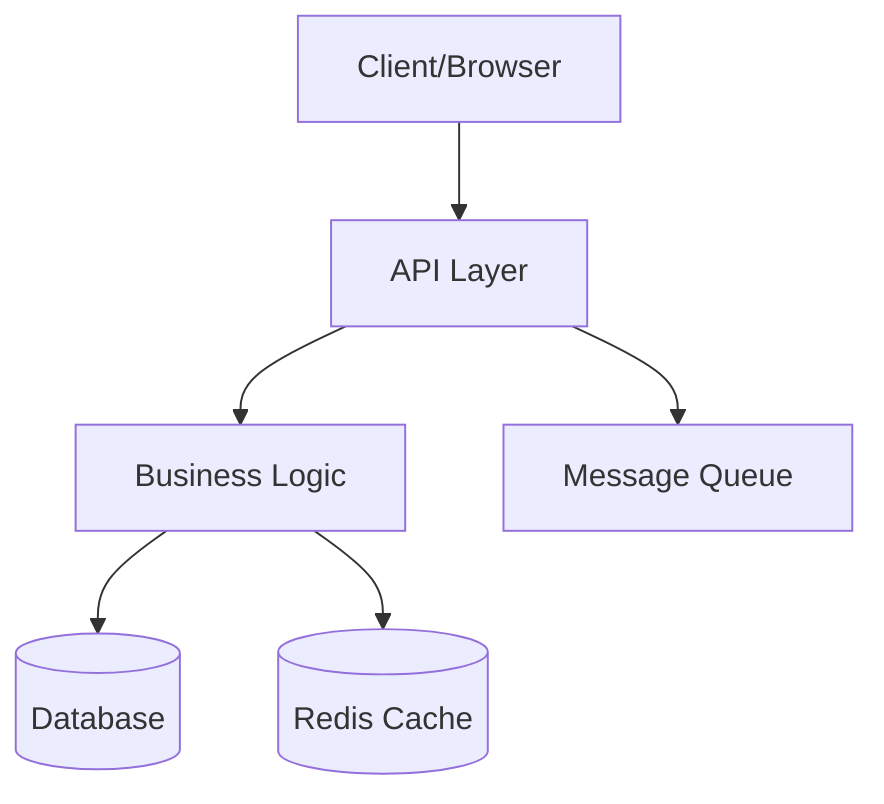

# codebase-summarizer

skills/patricio0312rev/skills/codebase-summarizer
codebase-summarizer
Installation
$ npx skills add https://github.com/patricio0312rev/skills --skill codebase-summarizer
SKILL.md
Codebase Summarizer

Generate comprehensive architecture documentation from repository analysis.

Core Workflow
Scan structure: Recursively analyze folder tree and file organization
Identify patterns: Detect framework, architecture style, key directories
Map entry points: Find main files, routes, APIs, CLI commands
Trace data flow: Follow requests through layers (controllers → services → models)
Document modules: Explain purpose and responsibilities of each directory
Create navigation: Build "how to" guides for common tasks
Generate diagrams: Add Mermaid diagrams for visual architecture
Documentation Structure
ARCHITECTURE.md Template
# Architecture Overview

## System Summary

[Project Name] is a [type] application built with [stack]. It follows [architecture pattern] and handles [primary use cases].

**Tech Stack:**

- Frontend: [framework + key libraries]
- Backend: [framework + key libraries]
- Database: [database + ORM]
- Infrastructure: [hosting + CI/CD]

## High-Level Architecture



Project Structure
src/
├── app/              # Application entry point and routing
├── components/       # Reusable UI components
├── lib/              # Utility functions and helpers
├── services/         # Business logic layer
├── models/           # Data models and schemas
└── types/            # TypeScript type definitions

Key Components
Entry Points

Main Application: src/app/page.tsx

Application entry point
Initializes providers and routing
Handles global error boundaries

API Routes: src/app/api/

RESTful API endpoints
Authentication middleware
Request validation
Core Modules

Authentication (src/services/auth/)

User login and registration
JWT token management
OAuth2 integration
Dependencies: bcrypt, jsonwebtoken

User Management (src/services/users/)

CRUD operations for users
Profile management
Role-based access control
Dependencies: Prisma, validation libraries

Data Layer (src/models/)

Database schemas
Prisma models
Query builders
Dependencies: Prisma Client
Data Flow
User Registration Flow
sequenceDiagram
    Client->>API: POST /api/auth/register
    API->>Validation: Validate input
    Validation->>Services: UserService.create()
    Services->>Database: Insert user
    Database-->>Services: User created
    Services->>Email: Send welcome email
    Services-->>API: Return JWT
    API-->>Client: 201 Created

Request Lifecycle
Request arrives → API route handler (src/app/api/[endpoint]/route.ts)
Middleware → Auth, validation, rate limiting
Service layer → Business logic (src/services/)
Data layer → Database queries (src/models/)
Response → Format and return data
Common Patterns
Service Pattern
// src/services/users/user.service.ts
export class UserService {
  async findById(id: string) {
    return prisma.user.findUnique({ where: { id } });
  }

  async create(data: CreateUserDto) {
    // Validation, business logic, database operations
  }
}

Repository Pattern
// src/repositories/user.repository.ts
export class UserRepository {
  async findAll() {
    /* DB queries only */
  }
  async findById(id: string) {
    /* DB queries only */
  }
}

How To Guides
Add a New API Endpoint

Create route file: src/app/api/[name]/route.ts

export async function GET(req: Request) {
  // Implementation
}


Add service logic: src/services/[name].service.ts

Define types: src/types/[name].ts

Add tests: src/app/api/[name]/route.test.ts

Update API docs: Document in OpenAPI/Swagger

Add a New Database Model

Update schema: prisma/schema.prisma

model NewModel {
  id String @id @default(cuid())
  // fields
}


Run migration: npx prisma migrate dev --name add-new-model

Generate types: npx prisma generate

Create service: src/services/new-model.service.ts

Add CRUD routes: src/app/api/new-model/

Add a New React Component
Create component: src/components/NewComponent/NewComponent.tsx
Add styles: NewComponent.module.css or inline Tailwind
Write tests: NewComponent.test.tsx
Add stories: NewComponent.stories.tsx (if using Storybook)
Export: Update src/components/index.ts
Modify Authentication
Service layer: src/services/auth/auth.service.ts
Middleware: src/middleware/auth.middleware.ts
Routes: src/app/api/auth/
Update tests: Ensure auth flows still work
Key Files Reference
File	Purpose	Modify For
src/app/layout.tsx	Root layout, providers	Global layout changes
src/lib/db.ts	Database connection	Connection config
src/lib/api.ts	API client setup	Request interceptors
src/middleware.ts	Next.js middleware	Auth, redirects
prisma/schema.prisma	Database schema	Data model changes
.env.example	Environment vars	Adding config values
Dependencies
Critical Dependencies
next - React framework
prisma - ORM and database toolkit
react - UI library
typescript - Type safety
Key Libraries
zod - Schema validation
bcrypt - Password hashing
jsonwebtoken - JWT handling
date-fns - Date utilities
Development Workflow
Local setup: See DEVELOPMENT.md
Making changes: Branch → Implement → Test → PR
Running tests: pnpm test
Database changes: Prisma migrate workflow
Deployment: Vercel automatic deployment
Troubleshooting

Database connection errors

Check DATABASE_URL in .env
Ensure database is running
Run npx prisma generate

Type errors after schema changes

Run npx prisma generate
Restart TypeScript server

Build fails

Clear .next folder: rm -rf .next
Clear node_modules: rm -rf node_modules && pnpm install
Additional Resources
API Documentation - Endpoint reference
Development Guide - Setup and workflow
Contributing Guide - Code standards
Database Schema - Data model details

## Analysis Techniques

### Identify Framework
Look for telltale files:
- `next.config.js` → Next.js
- `vite.config.ts` → Vite
- `nest-cli.json` → NestJS
- `manage.py` → Django
- `Cargo.toml` → Rust

### Map Entry Points
- Frontend: `index.html`, `main.tsx`, `app.tsx`, `_app.tsx`
- Backend: `main.ts`, `server.ts`, `app.py`, `index.js`
- CLI: `cli.ts`, `__main__.py`, `main.go`

### Trace Request Flow
Follow typical paths:
1. Route/endpoint definition
2. Middleware/guards
3. Controller/handler
4. Service/business logic
5. Repository/model
6. Database query

### Module Categories
- **Core**: Essential business logic
- **Infrastructure**: Database, cache, queue
- **Utilities**: Helpers, formatters, validators
- **Features**: User-facing functionality
- **Config**: Environment, settings

## Mermaid Diagrams

### Architecture Diagram
```mermaid
graph LR
    Client --> NextJS
    NextJS --> API
    API --> Services
    Services --> Prisma
    Prisma --> PostgreSQL

Data Flow
sequenceDiagram
    participant Client
    participant API
    participant Service
    participant DB
    Client->>API: Request
    API->>Service: Process
    Service->>DB: Query
    DB-->>Service: Data
    Service-->>API: Result
    API-->>Client: Response

Module Relationships
graph TB
    API[API Layer] --> Auth[Auth Service]
    API --> Users[User Service]
    Auth --> DB[(Database)]
    Users --> DB
    Users --> Cache[(Cache)]

Best Practices
Start high-level: Overview before details
Visual first: Use diagrams for complex flows
Be specific: Reference actual file paths
Show examples: Include code snippets
Link related docs: Reference other documentation
Keep updated: Update as architecture evolves
Developer-focused: Write for onboarding and daily use
Output Checklist

Every codebase summary should include:

 System overview and tech stack
 High-level architecture diagram
 Project structure explanation
 Entry points identification
 Module/directory purposes
 Data flow diagrams
 Common patterns documented
 "How to" guides for common tasks
 Key files reference table
 Dependencies explanation
 Troubleshooting section
Weekly Installs
187
Repository
patricio0312rev/skills
GitHub Stars
35
First Seen
Jan 24, 2026
Security Audits
Gen Agent Trust HubFail
SocketPass
SnykPass