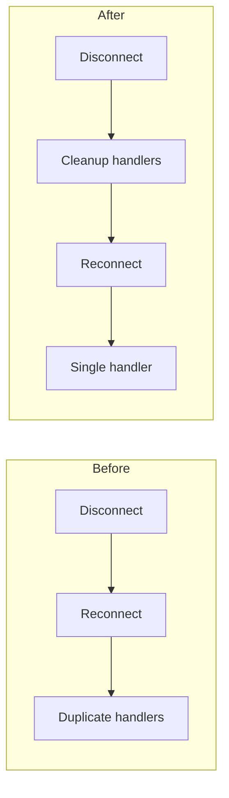

# blitz

skills/cygnusfear/agent-skills/blitz
blitz
Installation
$ npx skills add https://github.com/cygnusfear/agent-skills --skill blitz
SKILL.md
The Blitz: Parallel Worktree + Agent Workflow

Parallelizes multi-issue sprints by running independent agents in isolated git worktrees. Each agent implements their issue, self-reviews to 10/10 with 100% issue coverage, then changes are sequentially merged to avoid conflicts. Herding 🐲.

Platform-agnostic. Works with GitHub (gh CLI), Forgejo (API/tea CLI), or local tk tickets. See skills/obsidian-plan-wiki/references/platform-detection.md for detection rules and command mapping.

⚠️ MANDATORY: 100% Issue Coverage Per Agent

Every agent MUST implement 100% of their assigned issue's requirements before their PR can be merged.

Each agent receives COMPLETE issue requirements (extracted from issue/task)
Review must verify ALL requirements are implemented
Coverage < 100% = agent sent back to complete the work
No PR merges until all requirements from the issue are addressed
Prerequisites

Required Tools:

Platform CLI — gh for GitHub, tea/API for Forgejo, or tk for local tickets
Git with worktree support (2.5+)
teams tool for parallel worker delegation

Required Skills:

4-step-program - Guides agents through fix-review-iterate-present loop
code-reviewer - Self-review to 10/10 quality gate
delphi - Parallel oracles for triage decisions (optional, for ambiguous triage)
Workflow Phases
Phase 1: Issue Triage

For ambiguous decisions on which issues to tackle, use the delphi skill:

Invoke Delphi: "Audit these open issues. For each, recommend: close (complete), fix (actionable), or defer (blocked)."

Interpreting Delphi Results:

Unanimous agreement → Act on recommendation
2/3 agreement → Lean toward majority, investigate minority view
Full divergence → Need more context; investigate manually

Close complete issues immediately:

GitHub: gh issue close 1 2 3 --comment "Complete per Delphi audit"
Forgejo: Forgejo API PATCH /repos/{owner}/{repo}/issues/{index} with "state": "closed"
Local tk: tk close <id> for each completed task

For clear-cut issue lists, skip Delphi and proceed directly to Phase 2.

Phase 2: Worktree Setup

Create one worktree per fixable issue from main:

git worktree add .worktrees/<slug> -b fix/<slug> main

Branch Naming: fix/<descriptive-slug> or feat/<descriptive-slug>

Example setup for 4 issues:

git worktree add .worktrees/test-isolation -b fix/test-isolation main
git worktree add .worktrees/config-theater -b fix/config-theater main
git worktree add .worktrees/wire-salience -b fix/wire-salience main
git worktree add .worktrees/testing-quality -b fix/testing-quality main

Why Worktrees:

Complete filesystem isolation per agent
No stash/checkout conflicts
Agents work truly in parallel
Each has independent node_modules, build artifacts
Phase 3: Delegate to Parallel Agents

Delegate to workers using teams. Each worker needs:

Working directory (absolute path to worktree)
Issue context (number, description, acceptance criteria)
COMPLETE list of ALL requirements from the issue (extracted via platform — see above)
Explicit instruction to use 4-step-program skill

CRITICAL: Before delegating, extract ALL requirements from each issue:

GitHub: gh issue view <number>
Forgejo: tea issue view <number> or Forgejo API
Local tk: tk show <id>

List EVERY requirement, acceptance criterion, and edge case in the agent prompt.

Agent Prompt Template (adapt to platform):

Working directory: /absolute/path/to/.worktrees/<slug>
Issue: #<number> - <title>

**ALL REQUIREMENTS FROM ISSUE (100% must be implemented):**
1. [Requirement 1 from issue]
2. [Requirement 2 from issue]
3. [Requirement 3 from issue]
... (list ALL of them)

Use the 4-step-program skill to:
1. Implement ALL the above requirements (100% coverage required)
2. Run tests, verify passing
3. Create PR with `gh pr create` — **MUST include `Closes #<issue-number>` in body**
4. Self-review using code-reviewer skill (which will verify 100% coverage)
5. POST review to GitHub with `gh api`

**PR MUST include:**
- `Closes #<issue-number>` to auto-close the issue on merge
- "Related Issues" section in PR body
- Verify with `gh pr view --json closingIssuesReferences`

Do not return until you achieve 10/10 review score WITH 100% of issue requirements implemented AND issue properly linked.

Working directory: /absolute/path/to/.worktrees/<slug>
Issue: #<number> - <title>

**ALL REQUIREMENTS FROM ISSUE (100% must be implemented):**
1. [Requirement 1 from issue]
2. [Requirement 2 from issue]
3. [Requirement 3 from issue]
... (list ALL of them)

Use the 4-step-program skill to:
1. Implement ALL the above requirements (100% coverage required)
2. Run tests, verify passing
3. Create PR with Forgejo API or `tea pr create` — **MUST include `Closes #<issue-number>` in body**
4. Self-review using code-reviewer skill (which will verify 100% coverage)
5. POST review to Forgejo via API

**PR MUST include:**
- `Closes #<issue-number>` to auto-close the issue on merge
- "Related Issues" section in PR body

Do not return until you achieve 10/10 review score WITH 100% of issue requirements implemented AND issue properly linked.

Working directory: /absolute/path/to/.worktrees/<slug>
Task: <tk-id> - <title>

**ALL REQUIREMENTS FROM TASK (100% must be implemented):**
1. [Requirement 1 from task]
2. [Requirement 2 from task]
3. [Requirement 3 from task]
... (list ALL of them)

Use the 4-step-program skill to:
1. Implement ALL the above requirements (100% coverage required)
2. Run tests, verify passing
3. Commit all changes — no PR needed, merge happens locally
4. Self-review using code-reviewer skill (which will verify 100% coverage)
5. Post review as a ticket: `todos_oneshot(title: "Review: <branch>", tags: "review")`

Do not return until you achieve 10/10 review score WITH 100% of task requirements implemented.

CRITICAL: Agents must POST reviews to the platform, not just print them:

GitHub: gh api repos/OWNER/REPO/pulls/NUMBER/reviews -f body="..." -f event="COMMENT"
Forgejo: POST /repos/{owner}/{repo}/pulls/{index}/reviews via Forgejo API
Local tk: todos_oneshot(title: "Review: <branch>", tags: "review") — review lives as a ticket

Launch workers in parallel using teams:

teams(action: 'delegate', tasks: [
  {text: '<agent prompt for issue 1>', assignee: 'fix-issue-1'},
  {text: '<agent prompt for issue 2>', assignee: 'fix-issue-2'},
  {text: '<agent prompt for issue 3>', assignee: 'fix-issue-3'}
])

Phase 4: Review Iteration Loop

Monitor each PR/branch review status:

GitHub: gh pr view <NUMBER> --json reviews --jq '.reviews[-1].body'
Forgejo: Forgejo API GET /repos/{owner}/{repo}/pulls/{index}/reviews
Local tk: tk show <review-ticket-id> — check review ticket notes

TWO gates must pass for each PR:

GATE 1: 100% Issue Coverage

Verify ALL requirements from original issue are implemented
If ANY requirement is missing → Resume agent with missing requirements

GATE 2: 10/10 Review Quality

Zero suggestions in review
All verification commands pass

If coverage < 100%: Resume the agent with specific missing requirements:

PR #<NUMBER> coverage: 80% (4 of 5 requirements).
Missing requirement: [Requirement 5 from issue - specific text]
Implement this requirement and re-review.

If score < 10/10 (but coverage 100%): Resume the agent with specific feedback:

PR #<NUMBER> has 100% coverage but scored 8/10. Issues:
- <specific issue 1>
- <specific issue 2>

Fix these issues and re-review.

10/10 + 100% Coverage Criteria:

ALL requirements from original issue implemented
All functionality working
Tests pass
No obvious bugs or security issues
Code follows project conventions
Documentation updated if needed
Phase 4.5: FINAL COVERAGE GATE (Before Merge)

MANDATORY: Before merging ANY PR, perform LINE-BY-LINE requirement verification.

For EACH PR ready to merge:

Step 1: Extract ALL Requirements

GitHub:

gh issue view <issue-number> --json body --jq '.body' | grep -E "^\- \["
gh issue view <issue-number>

Forgejo:

# Via Forgejo API: GET /repos/{owner}/{repo}/issues/{index}
tea issue view <issue-number>

Local tk:

tk show <task-id>

Step 2: Create Line-by-Line Table

MANDATORY for each PR:

## Issue #X - Full Requirements Check

| Requirement | PR Status | Evidence |
|-------------|-----------|----------|
| [exact text from issue] | ✅ | `file.cs:line` - [implementation] |
| [exact text from issue] | ❌ MISSING | Not found in PR |
| [exact text from issue] | ⚠️ PARTIAL | `file.cs:line` - [what's missing] |
| [exact text from issue] | ⚠️ MANUAL | Requires Unity Editor |

Step 3: Honest Assessment
**Honest Assessment**:
- Coverage: X% (Y of Z requirements fully implemented)
- Missing: [list specific items]
- Partial: [list items and what's missing]
- Manual: [list items needing editor/runtime]

FINAL GATE DECISION:

Coverage	Action
100%	✅ Proceed to Phase 5 (Merge)
< 100%	❌ DO NOT MERGE - Resume agent

If Final Coverage < 100%:

Resume agent: "FINAL COVERAGE GATE FAILED for PR #<NUMBER>.

Issue #X - Full Requirements Check:

| Requirement | Status | Evidence |
|-------------|--------|----------|
| MeshDeformer component created | ✅ | MeshDeformer.cs |
| Create scene GameObject | ❌ MISSING | No scene modification |
| Cache hit rate >90% | ⚠️ MANUAL | Requires runtime profiler |

Honest Assessment:
- Coverage: 85% (11 of 13 requirements)
- Missing: scene GameObject creation
- Partial: none
- Manual: cache hit rate verification

Implement ALL items marked ❌. Items marked ⚠️ MANUAL that CAN be automated via mcp-unity MUST be automated.

Do not return until 100% coverage."

→ Loop back to Phase 4 (Review Iteration)

Phase 5: Sequential Squash-Merge + Rebase

Merge PRs one at a time. Order by dependency (infrastructure first).

Before merging, verify issue linking:

GitHub: gh pr view <NUMBER> --json closingIssuesReferences --jq '.closingIssuesReferences[].number' — if empty, send agent back to fix
Forgejo: Check PR body for Closes #X keywords
Local tk: tk show <id> — verify deps/links are set

For each PR/branch:

GitHub:

# 1. Squash merge — issues auto-close on merge
gh pr merge <NUMBER> --squash --delete-branch
# 2. Update local main
git checkout main && git pull
# 3. Rebase next PR onto updated main
cd .worktrees/<next-slug>
git fetch origin main
git rebase origin/main
git push --force-with-lease

Forgejo:

# 1. Merge via Forgejo API: POST /repos/{owner}/{repo}/pulls/{index}/merge
#    with "Do": "squash"
# 2-3. Same rebase workflow as above

Local tk:

# 1. Fast-forward merge locally
git checkout main
git merge --ff-only fix/<slug>
# 2. Close the task
tk close <task-id>
# 3. Rebase next branch onto updated main
cd .worktrees/<next-slug>
git rebase main

Why This Order:

Squash merge (or ff-only for local) keeps main history linear
Rebasing before merge prevents conflicts
Sequential merging catches integration issues early
--force-with-lease prevents overwriting others' work (remote platforms)

Handling Conflicts:

git rebase origin/main
# If conflicts:
# 1. Fix conflicts in affected files
# 2. git add <fixed-files>
# 3. git rebase --continue
# 4. git push --force-with-lease

Phase 6: Cleanup

After all branches merge:

# Remove worktrees
git worktree remove .worktrees/<slug>  # Repeat for each

# Delete local branches
git branch -D fix/<slug>  # Repeat for each

# Sync main (remote platforms only)
git checkout main && git pull

# Verify clean state
git worktree list  # Should show only main
git branch         # Should show only main

Quick Reference

See references/commands.md for complete command reference. See references/pitfalls.md for common issues and solutions.

Mermaid Diagrams in Blitz PRs

Each agent's PR/commit SHOULD include Mermaid diagrams when the change warrants visualization.

When Agents Should Add Diagrams
Change Type	Diagram
Flow change	flowchart before/after
API modification	sequenceDiagram
State handling	stateDiagram-v2
Architecture change	flowchart with subgraphs
Agent Delegation Should Include

When delegating to agents, add to the prompt:

If your changes involve flow modifications, state changes, or API interactions,
include a Mermaid diagram in the PR body (or commit message / review ticket) showing the new behavior.

Example PR with Diagram
## Summary

Fixed race condition in WebSocket reconnection.

### Before/After

## Related Issues
- Closes #45 - WebSocket reconnection bug

Checklist Summary
 Triage issues (use delphi if ambiguous)
 Extract ALL requirements from each issue (platform: gh issue view / tea issue view / tk show)
 Create worktrees for each fixable issue
 Launch parallel agents with 4-step-program including complete requirement lists
 Monitor and iterate until all PRs/branches hit 100% issue coverage AND 10/10
 FINAL COVERAGE GATE: Re-verify 100% coverage before each merge
 Sequential merge with rebase between (only after gate passes)
 Cleanup worktrees and branches
 PRs/commits include Mermaid diagrams where helpful
Weekly Installs
27
Repository
cygnusfear/agent-skills
First Seen
Feb 16, 2026
Security Audits
Gen Agent Trust HubPass
SocketPass
SnykWarn