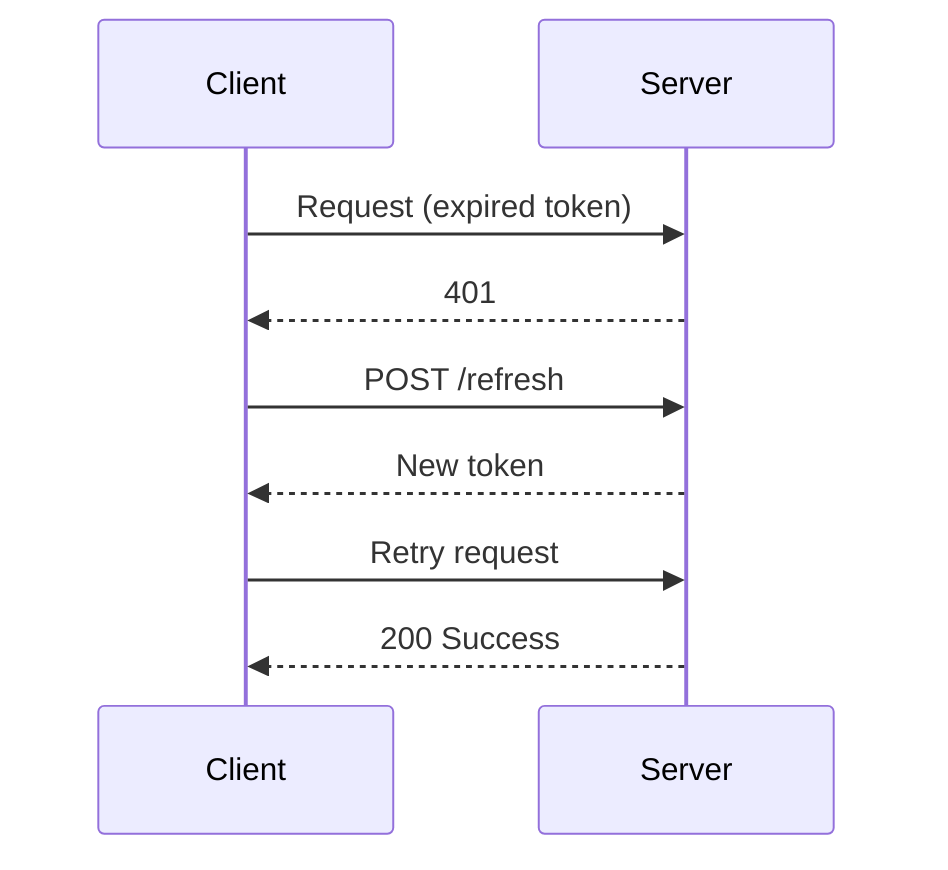

# 4-step-program

skills/cygnusfear/agent-skills/4-step-program
4-step-program
Installation
$ npx skills add https://github.com/cygnusfear/agent-skills --skill 4-step-program
SKILL.md
The 4 Step Program

A coordinator workflow for orchestrating dockeragents. You delegate, they implement. You enforce the loop until quality is achieved.

Platform Detection: This skill adapts to the active platform. See skills/obsidian-plan-wiki/references/platform-detection.md for detection rules and command mapping. When ambiguous, ask: "Are we working with GitHub, Forgejo, or local tickets?"

⚠️ MANDATORY: Review Posting

Every code review MUST be posted to the active platform. This is NOT optional.

The code-reviewer agent MUST post their review where the human can see it
A review that is not posted to the platform means the task has FAILED
The human needs to see the review to evaluate quality before merging
Platform	Where the review goes
GitHub	PR comment via gh pr comment or gh pr review
Forgejo	PR comment via Forgejo API
Local tk	Review ticket via todos_oneshot(tags: "review")

If the agent reports completion without posting to the platform, send them back to post it.

The Loop
┌─────────────────────────────────────────────────────┐
│                                                     │
│  ┌──────────┐    ┌──────────┐    ┌──────────────┐  │
│  │ 1. FIX   │───►│ 2. REVIEW│───►│ 3. 10/10?   │  │
│  │ (agent)  │    │ (agent)  │    │ (you check) │  │
│  └──────────┘    └──────────┘    └──────┬───────┘  │
│       ▲                                 │          │
│       │                                 │          │
│       │ NO                              │ YES      │
│       └─────────────────────────────────┤          │
│                                         ▼          │
│                                 ┌──────────────┐   │
│                                 │ 4. PRESENT   │   │
│                                 │ (you + links) │  │
│                                 └──────────────┘   │
│                                                     │
└─────────────────────────────────────────────────────┘

Step 1: Delegate FIX to Agent

Assign the implementation task to a dockeragent:

assign_task(agent_id, task_description)

The task description MUST include:

Clear action to perform
Context (issue/task IDs, file paths, errors)
ALL requirements from the issue/task (100% must be implemented)
Success criteria
Instruction to self-review using Skill(code-reviewer) and POST to the platform when done

CRITICAL: 100% Issue Coverage Requirement

When delegating, you MUST:

Read the full issue/task:
GitHub: gh issue view <number>
Forgejo: tea issue view <number> or Forgejo API
Local tk: tk show <id>
Extract EVERY requirement, acceptance criterion, and edge case
Include ALL of them in the delegation prompt
Make it clear that 100% of requirements must be implemented

Example delegation:

"Fix the authentication bug in src/auth.ts (Issue #45).

Requirements from issue (ALL must be implemented):

Session token expires correctly after 24 hours
Refresh token works when session token expires
Error message shown when both tokens expire
User redirected to login page on auth failure

Success: ALL 4 requirements implemented, tests pass, bug no longer reproducible.

When complete, run Skill(code-reviewer) on your changes, POST the review to the platform, and report the results with the PR/MR link (or ticket reference)."

IMPORTANT: The agent MUST ALWAYS create a PR/MR for work (or merge locally for tk flow), or update the existing PR/MR with the work they've done.

CRITICAL: PR/MR Must Link and Close Issues

When creating a PR/MR, agent MUST:

Use Closes #X or Fixes #X in PR/MR body (or tk dep/tk link for local tk)
Include "Related Issues" section listing all related issues/tasks
Verify issue links:
GitHub: gh pr view --json closingIssuesReferences
Forgejo: check PR body for Closes #X
Local tk: tk show <id> — check deps/links

Example PR/MR body must include:

## Related Issues
- Closes #45 - Auth token expiration bug
- Related to #40 - Auth system improvements

Step 2: Agent Performs REVIEW (MUST POST TO PLATFORM)

The dockeragent MUST invoke the code-reviewer skill on their own work:

Skill(code-reviewer)

This triggers the 6-pass ultra-critical methodology:

Technical Issues - Runtime failures, type errors, null handling
Code Consistency - Style, patterns, naming conventions
Architecture - Design, dependencies, complexity, coupling
Environment - Compatibility, security, performance risks
Verification - Run build, tests, linting - actual commands
Synthesis - Overall assessment with suggestion counts
CRITICAL: Review MUST Be Posted to Platform

The review is NOT complete until it is posted to the platform.

Platform	How review is posted
GitHub	mcp__github__create_pull_request_review or gh pr review
Forgejo	Forgejo API POST /repos/{owner}/{repo}/pulls/{index}/reviews
Local tk	todos_oneshot(title: "Review: <branch>", tags: "review")

The human needs to see the review on the platform. A local-only review that isn't posted is useless — the human won't see it and can't evaluate quality before merging.

Delegation must include:

"After reviewing, POST your review to the platform. The human must be able to see your review."

The agent reports back with:

Their review results
Confirmation that the review was posted to the platform
Link to the PR/MR (or ticket reference) where the review can be seen

IMPORTANT: The agent MUST ALWAYS post the review to the platform.

Step 3: You CHECK - Is the review 10/10 AND 100% Issue Coverage?

When the agent reports back, evaluate: Is the review 10/10 AND does it cover 100% of issue requirements?

100% Issue Coverage Check (MANDATORY)

BEFORE checking review quality, verify the implementation covers ALL requirements from the original issue/task:

Identify ALL requirements from the original issue/task:

Read the issue/task:
GitHub: gh issue view <number>
Forgejo: tea issue view <number> or Forgejo API
Local tk: tk show <id>
Extract every acceptance criterion
Note every edge case mentioned
List every functional requirement

Verify each requirement is implemented:

✅ Implemented: Code exists that fulfills this requirement
❌ NOT Implemented: Requirement missing from implementation

Coverage must be 100%:

If ANY requirement is missing → Send agent back immediately
Do NOT proceed to review quality check until coverage is 100%
10/10 Review Quality Check

A 10/10 review means ALL of the following:

100% of issue/task requirements implemented (verified above)
ZERO items in "Suggest Fixing" section
ZERO items in "Possible Simplifications" section
ZERO items in "Consider Asking User" section
ZERO further notes
All verification commands executed and passing
DO NOT ACCEPT POTENTIAL WORK IN REVIEW FOR A LATER PR (this is still a suggestion)
Review MUST be posted to the platform - if not posted, task is incomplete
If NOT 10/10 (any suggestions exist):

Send the agent back to fix:

send_message_to_agent(agent_id, "Review shows X suggestions. Fix all of them, then re-review with Skill(code-reviewer) and POST to the platform.")

→ Loop back to Step 1

If YES 10/10 (zero suggestions):

→ Proceed to Final Coverage Gate

Step 3.5: FINAL COVERAGE GATE (Before Presenting)

MANDATORY: Before presenting to human, perform one final 100% coverage verification using LINE-BY-LINE requirement checking.

Final Coverage Check Process
Step 1: Extract ALL Requirements from Issue/Task

Read the issue/task on the active platform:

GitHub: gh issue view <number> --json body --jq '.body' | grep -E "^\- \["
Also: gh issue view <number> for prose requirements
Forgejo: Forgejo API GET /repos/{owner}/{repo}/issues/{number} — parse body
Local tk: tk show <id> — read full ticket content

Don't rely on memory - actually parse the issue/task text.

Step 2: Create Line-by-Line Verification Table

MANDATORY - You MUST create this exact table:

## Issue/Task - Full Requirements Check

| Requirement | PR Status | Evidence |
|-------------|-----------|----------|
| [exact text from issue] | ✅ | `file.ts:line` - [implementation] |
| [exact text from issue] | ❌ MISSING | Not found in PR |
| [exact text from issue] | ⚠️ PARTIAL | `file.ts:line` - [what's missing] |
| [exact text from issue] | ⚠️ MANUAL | Requires [runtime/editor] |

Status meanings:

✅ = Fully implemented, can cite exact code
❌ MISSING = Not implemented at all
⚠️ PARTIAL = Partially implemented (counts as NOT done)
⚠️ MANUAL = Requires manual verification
Step 3: Calculate Honest Coverage
Implemented (✅ only) / Total Requirements = Coverage %

Be brutally honest:

⚠️ PARTIAL = NOT implemented
⚠️ MANUAL items that CAN be automated MUST be
State your confidence explicitly
Step 4: Honest Assessment
**Honest Assessment**:
- Coverage: X% (Y of Z requirements fully implemented)
- Missing: [list]
- Partial: [list with gaps]
- Manual: [list items needing runtime/editor]

Coverage Decision
Coverage	Action
100%	✅ Proceed to Step 4 (Present)
< 100%	❌ DO NOT PRESENT - Loop back to Step 1
If Coverage < 100%:
send_message_to_agent(agent_id, "FINAL COVERAGE CHECK FAILED.

Issue/Task - Full Requirements Check:

| Requirement | Status | Evidence |
|-------------|--------|----------|
| [requirement 1] | ✅ | file.ts:45 |
| [requirement 2] | ❌ MISSING | Not in PR |
| [requirement 3] | ⚠️ PARTIAL | Missing X |

Honest Assessment:
- Coverage: W% (Z of Y requirements)
- Missing: [requirement 2]
- Partial: [requirement 3] - needs X

Implement ALL items marked ❌ or ⚠️, then re-review with Skill(code-reviewer) and POST to the platform.

Do not return until 100% coverage achieved.")

→ Loop back to Step 1

If Coverage = 100%:

→ Proceed to Step 4

Step 4: PRESENT to Human

Report to the human with:

Summary of what was done
Confirmation of 100% issue coverage (list all requirements met)
PR/MR link or ticket reference (platform-appropriate)
Related issue/task links
Mermaid diagrams for complex changes (optional but recommended)
CRITICAL: Link Formatting

ALWAYS link PR/MR and issue references appropriately for the platform. This is mandatory.

Platform	How to reference
GitHub	[PR #N](https://github.com/OWNER/REPO/pull/N) and [Issue #N](https://github.com/OWNER/REPO/issues/N)
Forgejo	[PR #N](https://forgejo.instance/OWNER/REPO/pulls/N) and [Issue #N](https://forgejo.instance/OWNER/REPO/issues/N)
Local tk	Ticket ID: as-xxxx (link to .tickets/as-xxxx.md if needed)
Correct (GitHub example):
[PR #243](https://github.com/owner/repo/pull/243) is ready for review. Resolves [Issue #100](https://github.com/owner/repo/issues/100).

Correct (Local tk example):
Ticket `as-1f3a` is ready for review. Resolves task `as-0b2c`.

WRONG:
PR #243 is ready for review. Resolves Issue #100.

Never write bare PR #42 or Issue #100. ALWAYS include the full link or ticket reference.

Iteration Limits
Maximum 5 iterations before escalating to human
If agent isn't converging, something is fundamentally wrong
Escalate: "After 5 iterations, agent still has X suggestions. Need guidance."
Anti-Patterns
Anti-Pattern	Why It's Wrong
Accepting incomplete issue coverage	Issue had 10 requirements, only 8 implemented = NOT DONE. Send back.
Accepting "mostly done"	Not 10/10 = not done. Send back.
Skipping PR/MR before review	We need a PR/MR BEFORE review (or local merge for tk flow).
Skipping review step	Every task gets reviewed. No exceptions.
Reviewing code yourself	You coordinate. Agent reviews with skill.
Bare PR/issue references	Links are mandatory. Always link appropriately for the platform.
Presenting before 10/10	Loop isn't done. Keep iterating.
Review not posted to platform	TASK FAILS. Human can't see local-only reviews. Must be on the platform.
Accepting completion without platform post	Send agent back. Review isn't done until posted.
❌ Antipattern Examples: What NOT To Do

EXECUTIVE SUMMARY: ANY SCORE BELOW 10/10 → DO NOT APPROVE, DO NOT PRESENT EXECUTIVE SUMMARY: ANY COVERAGE BELOW 100% → DO NOT APPROVE, DO NOT PRESENT

Antipattern 0: Incomplete Issue Coverage
❌ WRONG:
"Issue #45 requested 5 features. Agent implemented 4 of them.
Review is 10/10. Ready to present!"

"The main bug is fixed. The edge case mentioned in the issue
can be handled in a follow-up. Presenting to human."

"Agent addressed the core requirements. Minor items from the
issue can be done later."

✅ CORRECT:
"Issue #45 has 5 requirements. Agent implemented 4.
Missing: Requirement 5 (handle timeout errors).
Sending agent back: 'Implement requirement 5 from issue #45 -
handle timeout errors as specified in the acceptance criteria.'"

"Review shows 10/10 quality BUT issue coverage is only 80%.
NOT presenting until 100% of issue requirements are implemented."

Why this is wrong: The issue exists because the user needs ALL the requirements. Presenting partial work means the issue is still not fixed. The user will have to open another issue for the missing requirements.

Antipattern 1: "CI Passes, Ready to Merge"
❌ WRONG:
"CI is green and all tests pass. Ready to merge!"
"Build successful, linting passed. Good to go!"

✅ CORRECT:
"CI passes. Now awaiting 10/10 review with all suggestions fixed before presenting to human."

Why this is wrong: CI passing is necessary but NOT sufficient. The loop requires a 10/10 review with ZERO suggestions. CI green + review suggestions = NOT DONE.

Antipattern 2: "Review 82/100 APPROVED"
❌ WRONG:
"Review: 82/100. Overall solid implementation. APPROVED."
"Review score: 9/10. Verdict: Ready to merge."
"Great work! 95/100, approved with minor notes."

✅ CORRECT:
"Review: 82/100. NOT APPROVED. Agent must fix all 18 points before re-review."
"Review: 9/10. NOT APPROVED. Loop back to Step 1 until 10/10."

Why this is wrong: ANY score below 10/10 means there are issues. Issues mean NOT DONE. Send the agent back. The loop continues until ZERO suggestions remain.

Antipattern 3: "Agent Needs Push Access / Cherry Pick"
❌ WRONG:
"Agent completed the work but needs push access to main."
"Changes ready, please cherry-pick commit abc123 to main."
"Work done locally, someone needs to push it."

✅ CORRECT:
"Agent creates branch → Agent creates PR/MR (or merges locally for tk flow)
→ Review posted to platform → 10/10 achieved → Present link to human"

Why this is wrong: Agents ALWAYS create a new branch and open a PR/MR (or merge locally in tk flow). The review goes ON the platform. No cherry-picking, no manual pushes, no special access needed. The PR/MR IS the deliverable.

Antipattern 4: "Good News, Everything Done!" (No Links)
❌ WRONG:
"Good news! Everything is already done! See PR #243 and #244."
"Fixed in PR #100, related to issue #50."
"All tasks complete - check PRs #10, #11, #12."

✅ CORRECT (GitHub):
"All tasks complete:
- [PR #243](https://github.com/owner/repo/pull/243) - Auth fix
- [PR #244](https://github.com/owner/repo/pull/244) - Test coverage
Related: [Issue #50](https://github.com/owner/repo/issues/50)"

✅ CORRECT (Local tk):
"All tasks complete:
- Ticket `as-1f3a` - Auth fix
- Ticket `as-2b4c` - Test coverage
Related: Task `as-0b2c`"

Why this is wrong: Bare numbers are not clickable/actionable. The human must be able to navigate directly. ALWAYS format with full links or ticket references appropriate to the platform.

Antipattern 5: "Open Items" Without Links
❌ WRONG:
"Open items:
- #535 Nix CI implementation (orphan spacetime branch)
- #102 Database migration pending
- Issue #88 still needs review"

✅ CORRECT (GitHub):
"Open items:
- [#535](https://github.com/owner/repo/issues/535) - Nix CI implementation (orphan spacetime branch)
- [#102](https://github.com/owner/repo/issues/102) - Database migration pending
- [Issue #88](https://github.com/owner/repo/issues/88) - Still needs review"

✅ CORRECT (Local tk):
"Open items:
- `as-535a` - Nix CI implementation (orphan spacetime branch)
- `as-102b` - Database migration pending
- `as-88cd` - Still needs review"

Why this is wrong: Every reference to a PR/MR or issue MUST be actionable. No exceptions. The human should never have to manually construct a URL or search for a ticket.

Mermaid Diagrams in Reviews and PRs

Agents posting reviews SHOULD include Mermaid diagrams when helpful.

Reviews and PRs/MRs benefit from visual representation:

Before/after flow changes
Architecture modifications
State machine changes
API interaction sequences
When Agents Should Include Diagrams
Change Type	Diagram Recommendation
Bug fix with flow change	flowchart showing before/after
New API endpoint	sequenceDiagram of request flow
State handling change	stateDiagram-v2
Component refactor	flowchart with component relationships
Example Review with Diagram
## Review Summary

The token refresh implementation correctly handles expiration.

### New Flow

**Score: 10/10** - All requirements met, clean implementation.

Quick Reference
1. DELEGATE   → assign_task with ALL issue requirements + review + platform posting instruction
2. WAIT       → Agent fixes + runs Skill(code-reviewer) + POSTS to platform
3. CHECK      → TWO gates must pass:
                GATE 1: Is 100% of issue/task requirements implemented?
                        NO  → send_message_to_agent with missing requirements, go to 2
                GATE 2: Is report 10/10 with ZERO suggestions? Is review posted?
                        NO  → send_message_to_agent, go to 2
                        YES → go to 3.5
3.5 FINAL GATE → Re-verify 100% coverage one last time before presenting
                 NO (< 100%)  → send_message_to_agent, go to 1
                 YES (100%)   → go to 4
4. PRESENT    → Tell human + CONFIRM 100% coverage + LINK the PR/MR or ticket ref + Mermaid diagrams (if complex)

Remember: You don't implement. You orchestrate the loop until 100% coverage AND 10/10. Final gate catches any missed requirements.

After completing the review loop, follow handbook 15.04 to create tk tickets for all surfaced issues.

Weekly Installs
26
Repository
cygnusfear/agent-skills
First Seen
Feb 16, 2026
Security Audits
Gen Agent Trust HubPass
SocketPass
SnykWarn