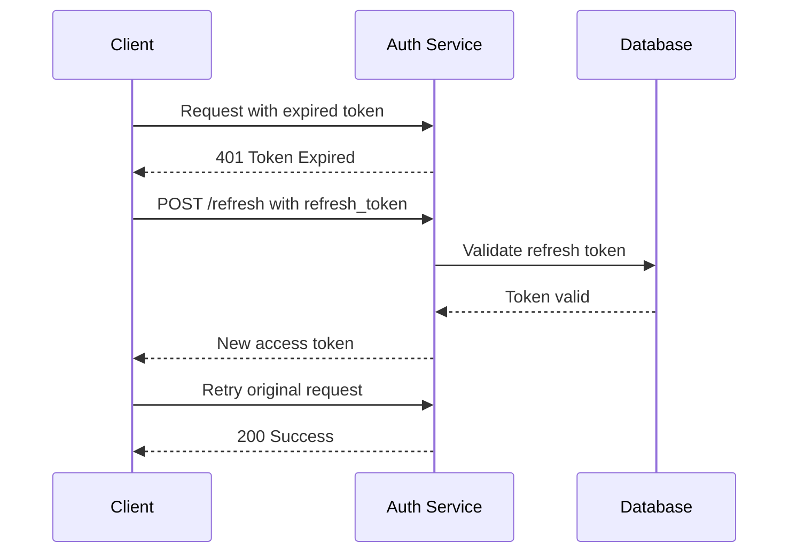

# create-pr

skills/cygnusfear/agent-skills/create-pr
create-pr
Installation
$ npx skills add https://github.com/cygnusfear/agent-skills --skill create-pr
SKILL.md
Create a PR / MR

Platform-aware: This skill adapts to GitHub, Forgejo, or local tk workflows. See skills/obsidian-plan-wiki/references/platform-detection.md for detection rules. For local tk, this skill becomes "prepare for merge" — no remote PR needed.

⚠️ MANDATORY: Issue Linking

Every PR/MR MUST link to related issues and use closing keywords.

PRs/MRs without issue links are incomplete
GitHub / Forgejo: Use Closes #X or Fixes #X to auto-close issues on merge
Local tk: Use tk dep / tk link to connect tickets
Reference ALL related issues, even if not closing them
Instructions
Step 1: Identify Related Issues

Find ALL issues this PR/MR addresses:

Issues explicitly being fixed
Issues partially addressed
Related issues for context

GitHub:

git branch --show-current
gh issue list --search "relevant keywords"
gh issue view <number>

Forgejo:

git branch --show-current
# Use tea CLI or Forgejo API
tea issue list
tea issue view <number>

Local tk:

git branch --show-current
tk ls
tk show <id>

Step 2: Gather Context
# See what changed (platform-agnostic)
git log main..HEAD --oneline
git diff main..HEAD --stat

# Get commit messages for context
git log main..HEAD --format="%s%n%b"

Step 3: Create PR/MR with Issue Links

Use the writing-clearly-and-concisely skill for clear writing, then follow pr_guide.

IMPORTANT: Do NOT include "Generated with Claude Code" (or any AI tool) or similar tool attribution footers in PR/MR descriptions.

GitHub:

gh pr create --title "[type]: [emoji] [description]" --body "$(cat <<'EOF'
[Two-sentence summary of what and why]

## Key Changes
- [Change 1]
- [Change 2]

## Related Issues

**Closes:**
- Closes #X - [brief description of what's fixed]
- Closes #Y - [brief description]

**Related (not closing):**
- Related to #Z - [why related]
- See also #W - [context]

## Testing
- [How it was tested]

## Files Changed
- [List key files]
EOF
)"

Forgejo:

# Use tea CLI or Forgejo API
tea pr create --title "[type]: [emoji] [description]" --description "..."
# Body format identical to GitHub — Forgejo recognizes the same closing keywords

Local tk:

# No remote PR needed — link tickets and prepare for local merge
tk link <task-id> <related-id>
tk dep <child-id> <parent-id>
tk add-note <task-id> "Ready to merge. Key changes: [summary]"

Issue Linking Keywords

GitHub and Forgejo recognize these keywords to auto-close issues on merge:

Keyword	Example	Effect
Closes	Closes #123	Closes issue when PR/MR merges
Fixes	Fixes #123	Closes issue when PR/MR merges
Resolves	Resolves #123	Closes issue when PR/MR merges

Use format: Closes #X - brief description

Local tk: Use tk dep <child> <parent> or tk link <a> <b> to connect tickets instead.

Step 4: Verify Issue Links

After creating PR/MR:

GitHub:

gh pr view <number> --json closingIssuesReferences
gh issue view <number>

Forgejo:

# Check PR body for Closes #X keywords
tea pr view <number>

Local tk:

# Verify ticket links/deps
tk show <id>

PR/MR Description Template
[Two-sentence summary: what changed and why it was needed]

## Key Changes
- [Most important change]
- [Second important change]
- [Third important change]

## Related Issues

**Closes:**
- Closes #X - [what requirement this addresses]
- Fixes #Y - [what bug this fixes]

**Related:**
- Related to #Z - [provides context but doesn't close]

## Testing
- [Manual testing performed]
- [Automated tests added/passing]

## Architectural Impact
[If significant: explain system-wide effects]

## Files Changed
- `path/to/file1.ts` - [what changed]
- `path/to/file2.ts` - [what changed]

Local tk note: When working locally, include this summary as a tk add-note on the task ticket instead of a PR body.

Anti-Patterns
❌ WRONG (any platform):
Creating a PR/MR with no description: --body "Fixed the thing"

❌ WRONG:
"Related: #123" (no closing keyword, issue won't close)

❌ WRONG:
No mention of any issues at all

✅ CORRECT (GitHub):
gh pr create --title "fix: 🔧 Resolve auth token expiration" --body "
Fixes session timeout by implementing token refresh.

## Related Issues
- Closes #123 - Auth token expires incorrectly
- Closes #124 - Users logged out unexpectedly
- Related to #100 - Auth system overhaul (partial)
"

✅ CORRECT (Forgejo):
tea pr create --title "fix: 🔧 Resolve auth token expiration" --description "..."
# Same body format — Forgejo uses same closing keywords

✅ CORRECT (Local tk):
tk add-note <task-id> "Ready to merge: fixes auth token expiration"
tk link <task-id> <related-id>

Mermaid Diagrams in PRs/MRs

Use Mermaid diagrams to visualize changes, flows, and architectural impacts.

GitHub and Forgejo render Mermaid natively. Include diagrams when:

Showing before/after state changes
Illustrating new data flows
Explaining component interactions
Depicting architectural changes

Local tk: Skip Mermaid diagrams — ticket notes are plain text.

When to Include Diagrams
PR/MR Type	Diagram Use
Bug fix	Before/after flow showing fix
New feature	User journey or data flow
Refactor	Component dependency changes
API changes	Request/response sequence
Example: PR/MR with Diagram
## Key Changes

Added token refresh flow when session expires.

### New Authentication Flow

## Related Issues
- Closes #123 - Token expiration handling

Diagram Types for PRs/MRs
## Flow changes: flowchart
## API interactions: sequenceDiagram
## State machines: stateDiagram-v2
## Data models: erDiagram

Tips:

Keep diagrams focused (5-10 nodes)
Show the change, not entire system
Before/after pairs are powerful
Embed in PR/MR body, not as links
Quick Reference
GitHub
Find issues: gh issue list --search "keywords"
Create PR: gh pr create --title "..." --body "..."
Link issues: Closes #X, Fixes #X in body
Verify: gh pr view --json closingIssuesReferences
Forgejo
Find issues: tea issue list or Forgejo API
Create MR: tea pr create --title "..." --description "..."
Link issues: Closes #X, Fixes #X in body
Verify: tea pr view <N> — check body for keywords
Local tk
Find tasks: tk ls
No PR needed: prepare for local merge
Link tasks: tk dep <child> <parent> / tk link <a> <b>
Note summary: tk add-note <id> "Ready to merge: [summary]"

All platforms: Add Mermaid diagrams for complex changes (GitHub/Forgejo only)

Weekly Installs
26
Repository
cygnusfear/agent-skills
First Seen
Feb 27, 2026
Security Audits
Gen Agent Trust HubPass
SocketPass
SnykWarn